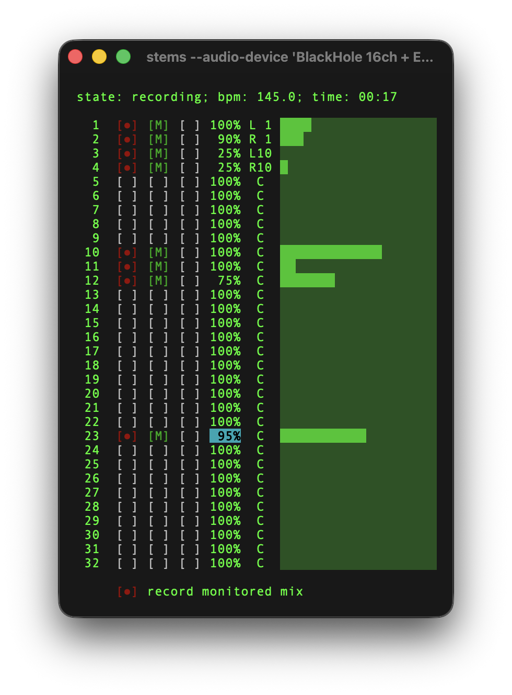

# stems

Terminal-based multi-track audio recorder with MIDI clock sync.

## Features

- **Multi-track recording** - One track per input channel (supports 32+ channels)
- **Audio file playback** - Play back WAV files during recording (e.g., backing tracks, click tracks)
- **Mix recording** - Record the monitored stereo mix to a single file (includes playback audio)
- **MIDI clock sync** - Recording and playback start on first clock pulse after MIDI Start
- **Real-time monitoring** - Low-latency monitoring with configurable routing
- **Aggregate device support** - Route audio from virtual devices to physical interfaces
- **Lock-free audio** - Real-time safe audio callbacks (atomics + ring buffers, no mutexes)
- **Per-track control** - Individual monitor/solo/level/pan for input and playback tracks
- **Direct CoreAudio integration** (macOS) - Custom FFI layer for immediate playback start/stop (~1-2ms latency)

## Usage

**Installation:** There's no binary distribution so you must compile it. Use
`make build` or `make install`.

```sh
# List available devices
stems --list-devices

# Run with default config (stems.yaml in current directory)
stems

# Use a specific config file
stems --config my-setup.yaml
```

### Configuration

stems uses a YAML configuration file for device and track settings. By default,
it looks for `stems.yaml` in the current directory.

See [examples/basic.yaml](examples/basic.yaml) for a complete, annotated example.

Create a `stems.yaml` file:

```yaml
devices:
  audio: "BlackHole 16ch + ES-9"  # Device name or index
  monitorch: "17-18"               # Monitor output channels (1-indexed)
  midiin: "mc-source-b"           # MIDI input device name or index

tracks:
  1:                               # Track number (1-based)
    arm: false
    monitor: true
    solo: false
    level: 1.0                     # 0.0 - 1.0
    pan: 0.0                       # -1.0 (left) to 1.0 (right)
  2:
    monitor: true
    level: 0.9
    pan: 0.5
  10:
    monitor: true

audio:                             # Optional: audio file playback
  - file: backing-track.wav        # Path to WAV file (48kHz required)
    monitor: true                  # Whether to hear this file
    solo: false                    # Solo this playback track
    level: 0.8                     # Playback volume (0.0 - 1.0)
    pan: 0.0                       # Pan position (-1.0 to 1.0)
  - file: click.wav
    monitor: true
    level: 0.5
```

### Command Line Flags

- `--list-devices` - Show all available audio and MIDI devices
- `--config <path>` - Specify configuration file (default: `stems.yaml`)

### Device Configuration

- **audio** - Device name or index for both input and output (ensures single clock domain)
  - Use device index (e.g., `"0"`) or name substring (e.g., `"ES-9"`)
  - Omit to use system default device
- **monitorch** - Output channels for monitoring (e.g., `"1-2"`, `"17-18"`)
  - Must be exactly 2 channels (stereo)
  - Channel numbers are 1-indexed
  - Defaults to `1-2` if not specified
- **midiin** - MIDI device name or index for transport control
  - Use device index or name substring
  - Omit to use first available MIDI device (if any)

### Track Configuration

Configure individual tracks by track number (1-based, matching the UI):

- **arm** - Whether track is armed for recording (boolean)
- **monitor** - Whether track is monitored (heard in output) (boolean)
- **solo** - Whether track is soloed (boolean)
- **level** - Track level, 0.0 to 1.0 (float)
- **pan** - Pan position, -1.0 (left) to 1.0 (right) (float)

Only specified tracks are configured; others use defaults (all false except level=1.0, pan=0.0).

### Audio Playback Configuration

Configure WAV files to play back during recording:

- **file** - Path to WAV file (absolute or relative to working directory)
  - Must be 48kHz sample rate (same as recording)
  - Supports mono and stereo files
  - Files are pre-loaded into memory at startup
- **monitor** - Whether to hear this file (boolean, default: true)
- **solo** - Whether to solo this file (boolean, default: false)
- **level** - Playback volume, 0.0 to 1.0 (float, default: 1.0)
- **pan** - Pan position, -1.0 (left) to 1.0 (right) (float, default: 0.0)

Playback tracks:
- Start/stop with MIDI transport (synchronized with recording)
- Loop continuously when they reach the end
- Are mixed into monitor output and included in mix recording
- Can be controlled individually (monitor, solo, level, pan)
- Are numbered starting from 1 in the UI

## Interface



### Commands

```
j/k, ↑/↓  = Navigate tracks (input tracks → playback tracks → mix recording row)

h/l, ←/→  = Navigate columns
            Input tracks: Arm/Monitor/Solo/Level/Pan
            Playback tracks: Monitor/Solo/Level/Pan
            Mix row: Arm only

Space     = Toggle arm/monitor or edit level/pan

R         = Toggle arm for all input tracks

M         = Toggle monitoring for all tracks (input + playback)

S         = Toggle solo for all tracks (input + playback)

g/G       = Jump to first track / mix recording row

?         = Toggle help

q, ctrl+c = quit
```

## Recording Output

### Individual Track Files
- **Format:** 32-bit float WAV, mono per track
- **Filename:** `{track}-{timestamp}.wav` (e.g., `01-20240115-143022.wav`)
- **Sample rate:** Matches input device sample rate
- **Location:** Current working directory

### Mix File
- **Format:** 32-bit float WAV, stereo
- **Filename:** `mix-{timestamp}.wav`
- **Content:** Recorded stereo mix of all monitored tracks with level and panning applied
- **Arming:** Toggle the mix recording checkbox at the bottom of the track list

## Architecture

- **Lock-free audio callbacks** - Uses atomics and ring buffers (no mutexes in real-time thread)
- **Separate input/output streams** - Independent recording and monitoring paths
- **Single clock domain** - Input and output use the same device (eliminates clock drift)
- **Real-time safe** - Audio callbacks never allocate, block, or do I/O

For detailed architecture information, see [docs/architecture.md](docs/architecture.md).

## Technical Notes

- One track is created for each input channel of the selected device
- Monitoring mixes all monitored tracks (input + playback) into stereo and routes to specified output channels
- Solo mode: When any track (input or playback) has solo enabled, only soloed tracks are heard in the monitor output and included in the mix recording
- MIDI clock-based recording and playback wait for first clock pulse after MIDI Start message
- Playback files are pre-loaded into memory at startup (no disk I/O during playback)
- Playback uses direct CoreAudio integration on macOS for ~1-2ms start/stop latency
- Sample rate automatically selected at 48000 Hz if supported by device
- Mix recording includes both input tracks and playback audio
