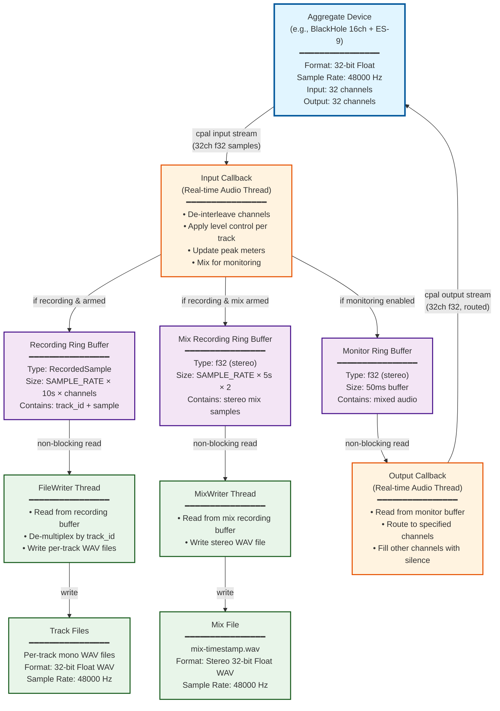

# Stems Audio Architecture

## Overview

Stems is a multi-track audio recorder that simultaneously records audio to disk
and provides real-time monitoring. It supports multi-channel aggregate devices
for routing audio from virtual loopback devices (like
[BlackHole](https://github.com/ExistentialAudio/BlackHole)) to physical audio
interfaces. In addition to recording individual tracks, stems can also record
the monitored stereo mix to a single file.

Stems also supports **audio file playback** during recording sessions. Pre-loaded
WAV files play back in sync with MIDI transport, allowing you to record along with
existing audio (e.g., backing tracks, click tracks). Playback audio is mixed into
both the monitor output and the recorded mix.

This doc uses BlackHole 16ch and
[ES-9](https://www.expert-sleepers.co.uk/es9.html) as an example, but the
concepts apply to any single or aggregate device configuration.

## Audio Flow Diagram



## Key Components

### 1. Aggregate Audio Device

Stems works best with macOS **Aggregate Devices** that combine:
- **Virtual audio loopback** (e.g., BlackHole 16ch) - receives audio from other applications
- **Physical audio interface** (e.g., ES-9) - for monitoring through speakers/headphones

#### Creating an Aggregate Device:
1. Open **Audio MIDI Setup** (Applications → Utilities)
2. Click **+** → **Create Aggregate Device**
3. Check both devices (e.g., BlackHole 16ch and ES-9)
4. Set the **physical interface as Clock Source** (ensures single clock domain)
5. Name it (e.g., "BlackHole + ES-9")

**Channel mapping:**
- **Input channels:** Device 1 inputs (1-16), then Device 2 inputs (17-32)
- **Output channels:** Device 1 outputs (1-16), then Device 2 outputs (17-32)

### 2. Input Processing

**Real-time audio thread** with critical constraints:
- NO memory allocations
- NO mutex locks (atomics only)
- NO I/O operations
- NO blocking calls

**Processing per audio frame:**
1. De-interleave input channels
2. For each track:
   - Apply level control
   - Update peak meter
   - If recording AND track armed → push to recording buffer
   - If monitoring enabled → mix into monitor output (with level and panning applied)
3. Push stereo mix to monitor buffer
4. If recording AND mix armed → push stereo mix to mix recording buffer

### 3. Recording Ring Buffer

- **Type:** `rtrb::RingBuffer<RecordedSample>`
- **Size:** `SAMPLE_RATE × 10 seconds × num_channels`
- **Lock-free:** Non-blocking push/pop for real-time safety
- **Contents:** Each sample contains `track_id` + `f32 sample value`

### 4. Monitor Ring Buffer

- **Type:** `rtrb::RingBuffer<f32>`
- **Size:** `output_sample_rate × 2 channels × 50ms`
- **Lock-free:** Non-blocking push/pop
- **Contents:** Stereo mix of monitored tracks

### 5. Mix Recording Ring Buffer

- **Type:** `rtrb::RingBuffer<f32>`
- **Size:** `SAMPLE_RATE × 5 seconds × 2 channels`
- **Lock-free:** Non-blocking push/pop
- **Contents:** Interleaved stereo mix samples with level and panning applied (same as monitor output)
- **Purpose:** Records the monitored mix to a single stereo file

### 6. FileWriter Thread

- Runs in **separate non-realtime thread**
- Reads from recording ring buffer
- De-multiplexes samples by `track_id`
- Writes per-track WAV files to disk
- **Format:** 32-bit Float WAV @ input sample rate

### 7. MixWriter Thread

- Runs in **separate non-realtime thread**
- Reads from mix recording ring buffer
- Writes stereo mix to single WAV file
- **Format:** Stereo 32-bit Float WAV @ 48000 Hz
- **Filename:** `mix-{timestamp}.wav`

### 8. Audio Playback System

Stems can play back pre-loaded WAV files during recording:

**File Loading:**
- WAV files configured in `stems.yaml` under `audio:` section
- Files are loaded into memory at startup (no disk I/O during playback)
- Must be 48kHz sample rate (same as recording)
- Supports mono and stereo files

**Playback Integration:**
- Playback tracks have individual monitor, solo, level, and pan controls
- Audio is mixed into the input callback's monitor output
- Playback audio is included in the monitored mix recording
- Playback position advances frame-by-frame during playback
- Files loop continuously when they reach the end

**MIDI Control:**
- Playback starts with MIDI Start message
- Playback stops with MIDI Stop message
- Synchronized with recording transport

**CoreAudio Direct Integration (macOS):**
For low-latency playback with immediate stop capability, stems uses a custom
CoreAudio FFI layer (`src/audio/coreaudio_playback_ffi.m`):
- Direct AudioUnit API access bypasses cpal's buffering limitations
- Audio unit runs continuously (never stopped during normal operation)
- Start/stop controlled by atomic flags for ~1-2ms latency
- Allows device selection for routing to aggregate devices
- Compiled into the binary via `build.rs`

### 9. Monitor Output with Channel Routing

The output callback routes the stereo monitor mix to specific output channels:

```rust
// For aggregate device with BlackHole (ch 1-16) + ES-9 (ch 17-32):
// Monitor channels 17-18 routes audio to ES-9 outputs

for each frame:
    - Fill all output channels with silence (0.0)
    - Place left sample in monitor_start channel
    - Place right sample in monitor_end channel
```

**Example:** With `--monitor-channels 17-18`:
- Channels 1-16 (BlackHole outputs): Silence
- Channels 17-18 (ES-9 L+R outputs): Monitor audio
- Channels 19-32 (remaining ES-9 outputs): Silence

## Command Line Usage

### Basic Usage

```bash
# Single device (uses channels 1-2 for monitoring)
stems --audio-device "ES-9" --midi-device mc-source-b

# Aggregate device with monitor routing
stems --audio-device "BlackHole + ES-9" \
      --monitor-channels 17-18 \
      --midi-device mc-source-b
```

### Flags

- `--audio-device <name>` - Audio device for both input and output (ensures single clock domain)
- `--monitor-channels <START-END>` - Output channels for monitoring (e.g., `17-18`, `1-2`)
  - Must be exactly 2 channels (stereo)
  - 1-indexed (channel 1 is the first channel)
  - Defaults to `1-2` if not specified
- `--midi-device <name>` - MIDI device for transport control
- `--list-devices` - Show all available audio and MIDI devices

### Example Setup

**Scenario:** Record audio from a synthesizer application (the-synth) while monitoring through ES-9

1. **Create aggregate device** in Audio MIDI Setup:
   - Name: "BlackHole + ES-9"
   - Devices: BlackHole 16ch (first), ES-9 (second)
   - Clock Source: ES-9

2. **Configure the-synth:**
   - Output device: BlackHole 16ch
   - Output channels: 1-2 (or any channels you want)

3. **Run stems:**
   ```bash
   stems --audio-device "BlackHole + ES-9" \
         --monitor-channels 17-18 \
         --midi-device mc-source-b
   ```

4. **Audio flow:**
   - the-synth → BlackHole channels 1-2
   - stems reads from BlackHole channels 1-2 (aggregate inputs 1-2)
   - stems records to WAV files
   - stems monitors to ES-9 channels 1-2 (aggregate outputs 17-18)
   - You hear audio through ES-9!

## Implementation Details

### Device Configuration

**Max channels detection:**
- Queries device for maximum input channels
- Queries device for maximum output channels
- **Sample rate selection:** Prefers 48000 Hz if supported, falls back to minimum
- **Avoids:** Automatically selecting maximum sample rate (96kHz+)

### Audio Engine

**Initialization:**
1. Query device for maximum input channels (e.g., 32)
2. Query device for maximum output channels (e.g., 32)
3. Create one track per input channel
4. Create ring buffers for recording and monitoring
5. Build input stream with all input channels
6. Build output stream with all output channels

**Stream configuration:**
- **Input:** Uses all available input channels
- **Output:** Uses all available output channels
- **Buffer size:** Fixed 256 samples for low latency
- **Format:** 32-bit Float (f32) for both input and output

### Single Clock Domain

When `--audio-device` is specified, **both** input and output use the same device:
- ✅ No clock drift between devices
- ✅ No sample rate conversion needed
- ✅ No buffer underruns/overruns
- ✅ Perfect audio quality

For aggregate devices, the **Clock Source** device (typically the physical interface) provides the master clock that all sub-devices sync to.

## File References

- Audio engine: `src/audio/engine.rs`
- Audio callbacks: `src/audio/callback.rs`
- Device configuration: `src/audio/device.rs`
- Track file writer: `src/audio/writer.rs`
- Mix file writer: `src/audio/mix_writer.rs`
- Playback track: `src/audio/playback.rs`
- CoreAudio FFI: `src/audio/coreaudio_playback_ffi.m`, `src/audio/coreaudio_playback_ffi.h`, `src/audio/coreaudio_playback.rs`
- CLI argument parsing: `src/main.rs`
- Track management: `src/audio/track.rs`
- Build configuration: `build.rs`

## Notes

- **Recording to disk** uses large buffer (10 seconds) and is not timing-critical
- **Mix recording** uses 5-second buffer and records the same stereo mix sent to monitor output
- **Monitor output** is real-time with small buffer (50ms) - sensitive to timing
- The `--audio-device` flag applies to **both input and output** for single clock domain
- Aggregate devices must have sub-devices enabled in Audio MIDI Setup
- Virtual devices (like BlackHole) have no physical clock and sync to the Clock Source
- Mix recording is optional and controlled via the UI checkbox below the track list
